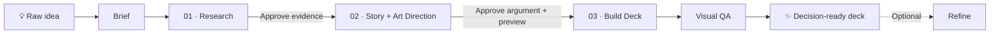

# Idea to Deck

<div align="center">

### From a raw idea to a decision-ready presentation

**Research-backed · Storylined · Art-directed · Self-contained HTML**

Works with **Codex** and **Claude Code**

</div>

---

Give the skill a rough concept. It researches the facts, builds the argument, previews the visual direction, then creates a polished HTML deck you can open from disk.

> **No mystery deck generation.** You approve the evidence first, then the story and visual direction, before the full deck exists.

## The workflow



| Stage | What the skill does | What you approve |
|---|---|---|
| **Brief** | Captures audience, decision, duration, language, brand inputs, and desired mood. | The context it should optimize for. |
| **01 — Research** | Finds primary sources, assigns stable source IDs, identifies counterpoints, and records open questions. | The factual foundation. |
| **02 — Story + Art Direction** | Writes the narrative slide plan and creates a three-slide visual preview using real content. | The argument **and** how the deck should feel. |
| **03 — Build + QA** | Builds the full offline HTML deck, renders it at multiple sizes, and fixes visual defects. | The final deck. |
| **Refine** | Applies focused feedback such as “more premium” or “less motion.” | Only the requested visual adjustment. |

## What makes the decks feel intentional

| Story | Design |
|---|---|
| Answer appears early — no slow reveal. | One visual direction, not a random slide-by-slide style. |
| Every claim traces to a source ID. | A title, metric, comparison, process, counterpoint, decision, and sources each get an appropriate layout. |
| Counterarguments are included deliberately. | Tokens, typography, color rhythm, chart treatment, and one signature motif stay consistent. |
| One idea per slide; no filler toward a slide count. | Motion is subtle, purposeful, and respects reduced-motion settings. |

### Visual directions

The skill recommends one direction based on the audience and decision, then lets you change it before the deck is built.

| Direction | Best fit | Character |
|---|---|---|
| **Editorial Signal** | Leadership and strategy | Restrained palette, oversized type, asymmetric rules |
| **Midnight System** | Technology and data | Dark field, luminous accent, precise grids |
| **Warm Modern** | People and customer stories | Warm neutrals, generous whitespace, human tone |
| **Bold Swiss** | Pitches and clear recommendations | High contrast, strict grid, one vivid accent |

The preview is saved as `direction.html` and includes a real title slide, evidence or big-number slide, and comparison or process slide. Its tokens and components become the seed for the final deck.

## What using it feels like

```text
You:
$idea-to-deck Why our company should launch local event discovery

Skill:
Who is the audience, what decision should they make,
how long is the presentation, and should it feel premium,
editorial, technical, warm—or should I choose?

You:
Leadership team. Approve an MVP. Ten minutes. Choose the style.

Skill:
[Research summary]
Strongest counterpoint: …
Open question: …
Approve the research?

You:
Approve.

Skill:
[10-slide storyline]
Recommended direction: Editorial Signal
[direction.html — title, evidence, and comparison preview]
Approve the story and visual direction?

You:
Make it darker and more premium.

Skill:
[Revised direction preview]

You:
Approve.

Skill:
[Builds, screenshots, checks, and delivers deck.html]
```

## Deliverables

```text
decks/<concept>/
├── state.md          # Brief and explicit approval state
├── research.md       # Claims, evidence, counterpoints, source registry
├── storyline.md      # Approved slide-by-slide narrative
├── direction.html    # Approved three-slide visual preview
└── deck.html         # Final self-contained presentation
```

The final deck works from `file://`: no CDN, webfonts, or runtime network requests. It includes keyboard, touch, and fullscreen controls; print support; source markers; and accessibility basics.

## Install

### Codex

Ask Codex:

```text
Use $skill-installer to install:
https://github.com/chanooooot/idea-to-deck-skill/tree/main/skills/idea-to-deck
```

Or run:

```bash
python3 ~/.codex/skills/.system/skill-installer/scripts/install-skill-from-github.py \
  --repo chanooooot/idea-to-deck-skill \
  --path skills/idea-to-deck
```

Invoke it with:

```text
$idea-to-deck <your concept>
```

For a project-only install, copy `skills/idea-to-deck` to `.agents/skills/idea-to-deck`.

### Claude Code

Install it as a personal skill:

```bash
git clone --depth 1 https://github.com/chanooooot/idea-to-deck-skill.git /tmp/idea-to-deck-skill
mkdir -p ~/.claude/skills
cp -R /tmp/idea-to-deck-skill/skills/idea-to-deck ~/.claude/skills/
```

Invoke it with:

```text
/idea-to-deck <your concept>
```

For a project-only install, copy the same folder to `.claude/skills/idea-to-deck`.

<details>
<summary><strong>Compatibility</strong></summary>

The shared skill uses standard `SKILL.md` frontmatter and does not require platform-specific tools or companion skills. The folders under `references/` provide detailed guidance only when that phase needs it.

</details>
